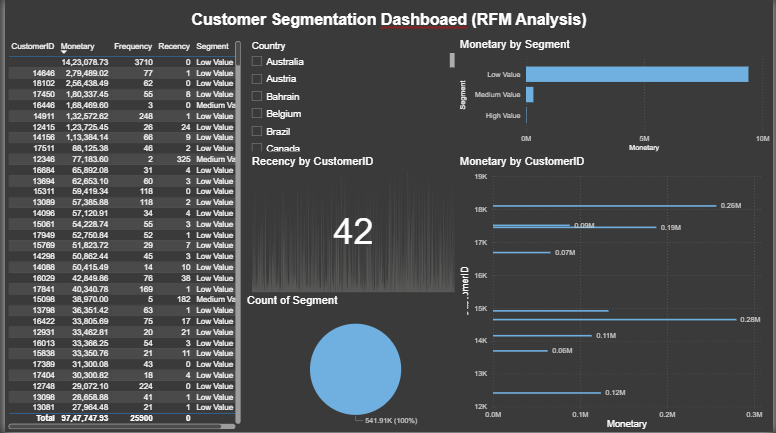

# RFM-Customer-Segmentation
Power BI RFM analysis dashboard project

# Customer Segmentation using RFM Analysis

## 📊 Project Overview
This project analyzes customer behavior using RFM (Recency, Frequency, Monetary) analysis.

## 🚀 Tools Used
- Power BI
- Excel

## 🔍 Key Insights
- High-value customers contribute most revenue
- Customer segmentation helps in targeted marketing

## 📁 Files
- Power BI Dashboard (.pbix)
- Project PDF

